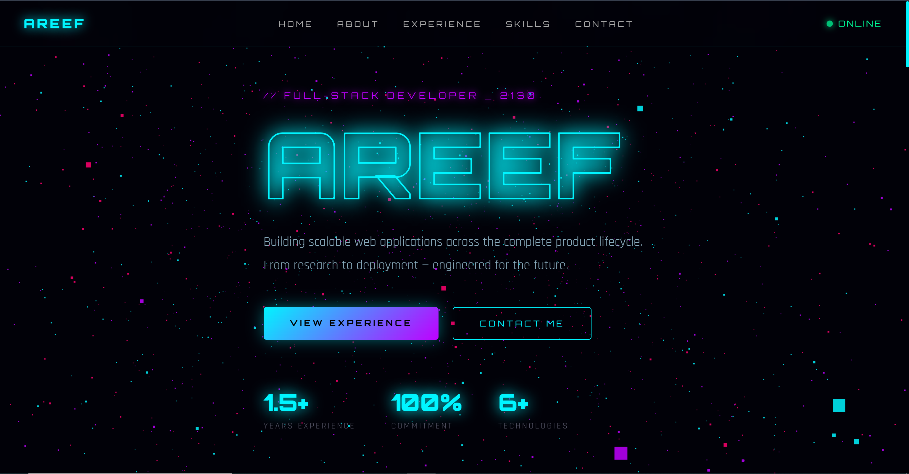
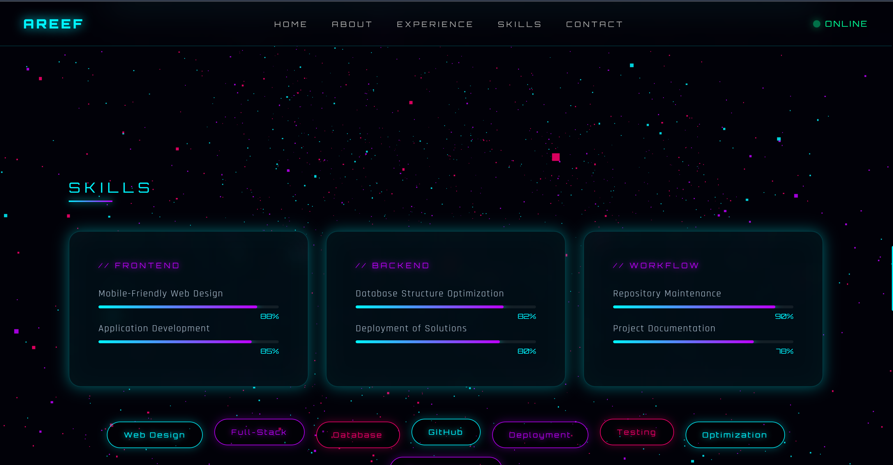

# areef-portfolio-cosmos

> A futuristic single-page developer portfolio featuring a Three.js 3D particle universe background, glassmorphism UI, neon cyan/purple animations, glitch text effects, and smooth scroll reveal — built for the cosmos.




---

## 🚀 Live Demo

🌐 **[https://vaironix-cosmos-portdolio.vercel.app/](https://vaironix-cosmos-portdolio.vercel.app/)**

> Deployed on Vercel — no build tools or server required.

---

## ✨ Features

- **3D Particle Universe** — 6,000 Three.js particles in cyan, purple, and pink rotating in real time with mouse parallax
- **Glassmorphism UI** — Frosted glass cards with neon glow borders throughout all sections
- **Glitch Hero Animation** — Name rendered with CSS glitch keyframes and neon stroke effect
- **Scroll Reveal** — IntersectionObserver-based fade-slide animation on every section card
- **3D Card Tilt** — Perspective tilt effect on all glass cards triggered by mouse movement
- **Animated Skill Bars** — Neon gradient progress bars that animate into view on scroll
- **Floating Skill Orbs** — Floating pill tags with CSS keyframe levitation
- **Glowing Timeline** — Vertical experience timeline with animated pulsing dots
- **Contact Form** — Fully functional UI form with success feedback
- **Sticky Nav** — Fixed glassmorphism navbar with underline hover effect and live status indicator
- **Responsive Design** — Mobile-friendly layout with media query breakpoints
- **Custom Scrollbar** — Styled neon cyan scrollbar

---

## 🗂️ Project Structure

```
areef-portfolio-cosmos/
├── index.html       # Full HTML structure — all sections
├── style.css        # All styles, CSS variables, animations, responsive
├── script.js        # Three.js particle bg, scroll reveal, tilt, form
├── image1.png       # Screenshot — Hero section
└── image2.png       # Screenshot — Sections overview
```

---

## 🛠️ Tech Stack

| Technology | Purpose |
|---|---|
| HTML5 | Semantic page structure |
| CSS3 | Glassmorphism, animations, responsive layout |
| Vanilla JavaScript | Scroll reveal, tilt effect, form handler |
| [Three.js r128](https://threejs.org/) | 3D particle universe background |
| [Orbitron](https://fonts.google.com/specimen/Orbitron) | Futuristic display font |
| [Rajdhani](https://fonts.google.com/specimen/Rajdhani) | Body and UI font |

---

## 📐 Sections

| Section | Description |
|---|---|
| **Hero** | Full-viewport name, tagline, CTA buttons, stat counters |
| **About** | Professional summary, contact info cards |
| **Experience** | Glowing vertical timeline — Alstonair (8 months) + Vaironix (6 months) |
| **Skills** | Animated neon skill bars grouped by Frontend / Backend / Workflow + floating orbs |
| **Education** | B.Tech CSE — R S R Engineering College, 2023 |
| **Contact** | Message form + social links + location card |

---

## 🎨 Design System

```css
--cyan:   #00f5ff   /* Primary accent — neon cyan  */
--purple: #bf00ff   /* Secondary accent — electric purple */
--pink:   #ff006e   /* Tertiary accent — hot pink  */
--dark:   #010108   /* Background — deep space black */
```

**Fonts:** Orbitron (headings) · Rajdhani (body)

**Effects:** Glassmorphism · Neon glow · Glitch animation · Particle field · 3D tilt · Scroll reveal

---

## ⚡ Getting Started

No installation needed. Just clone and open.

```bash
git clone https://github.com/areef-shaik/areef-portfolio-cosmos.git
cd areef-portfolio-cosmos
# Open index.html in your browser
```

Or simply double-click `index.html`.

---

## 📸 Screenshots

| Hero | Experience |
|---|---|
|  |  |

---

## 👤 Author

**Areef Shaik** — Full-Stack Developer

- 📧 areef.shaik0123@gmail.com
- 📞 +91 9110349362
- 🔗 [linkedin.com/in/areef-shaik3](https://www.linkedin.com/in/areef-shaik3/)
- 📍 Bengaluru, India

---

## 📄 License

This project is open source and available under the [MIT License](LICENSE).
